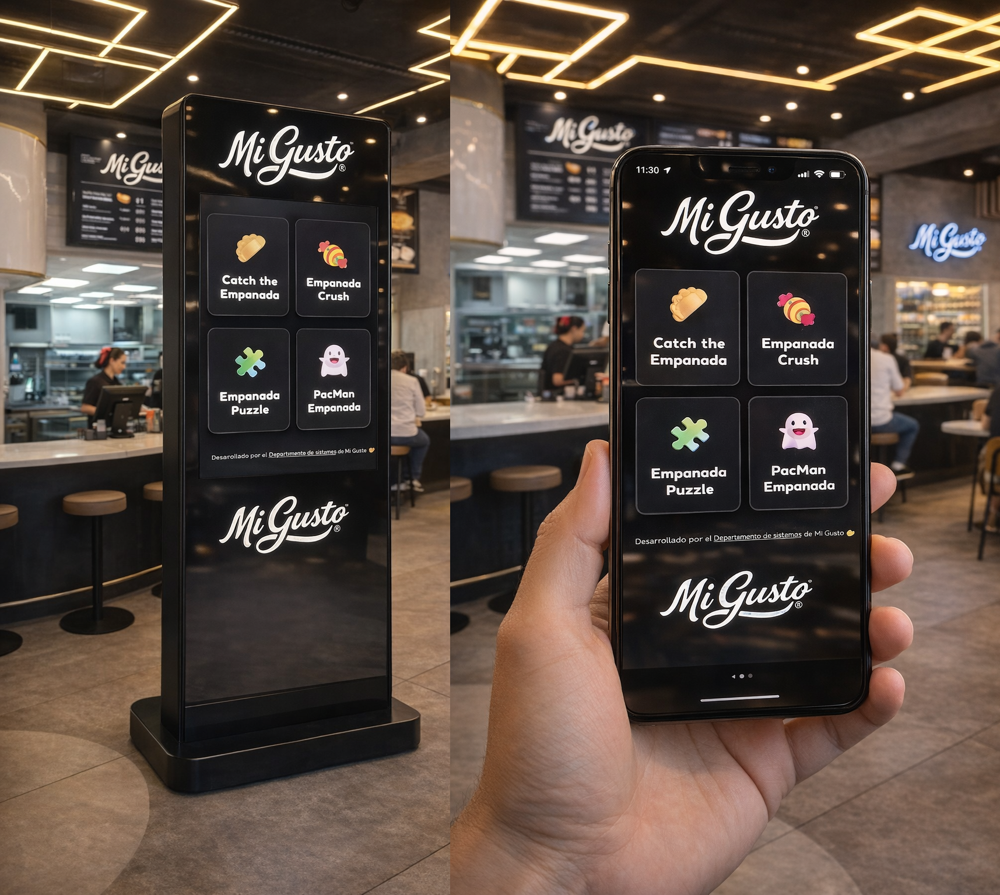
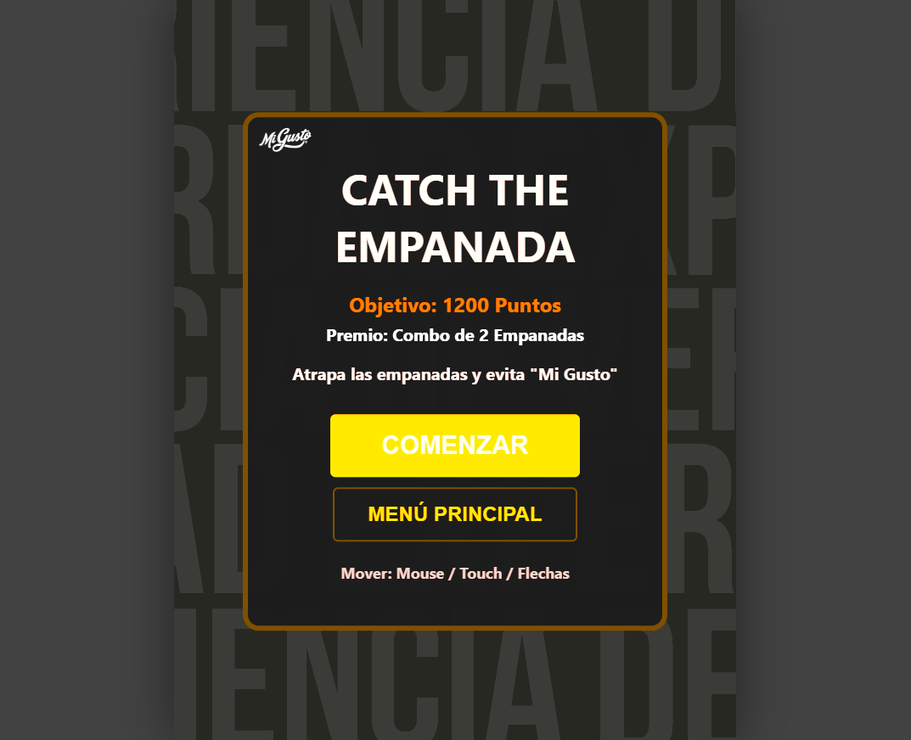
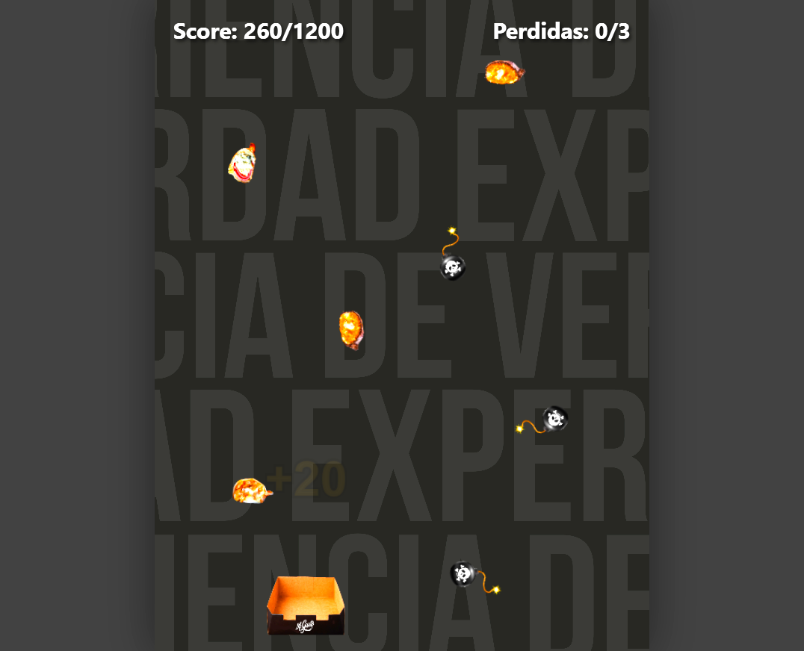
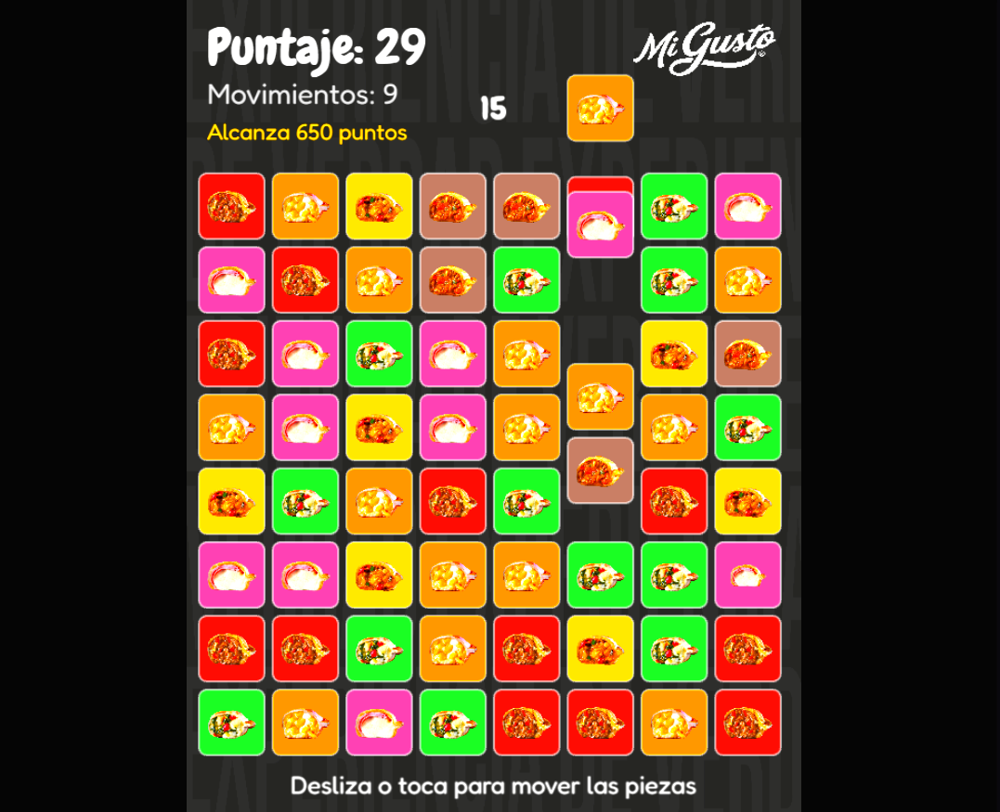
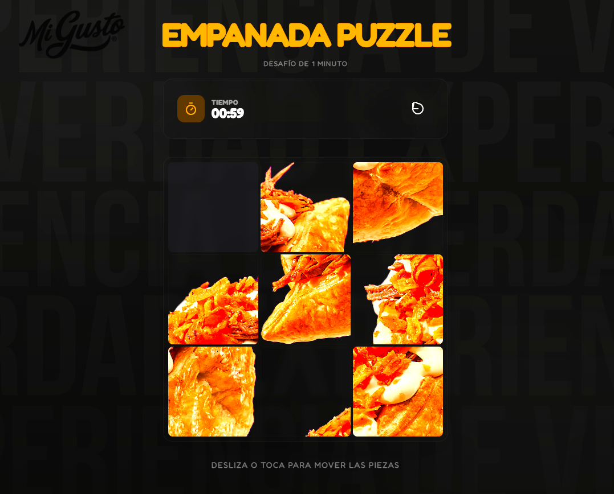
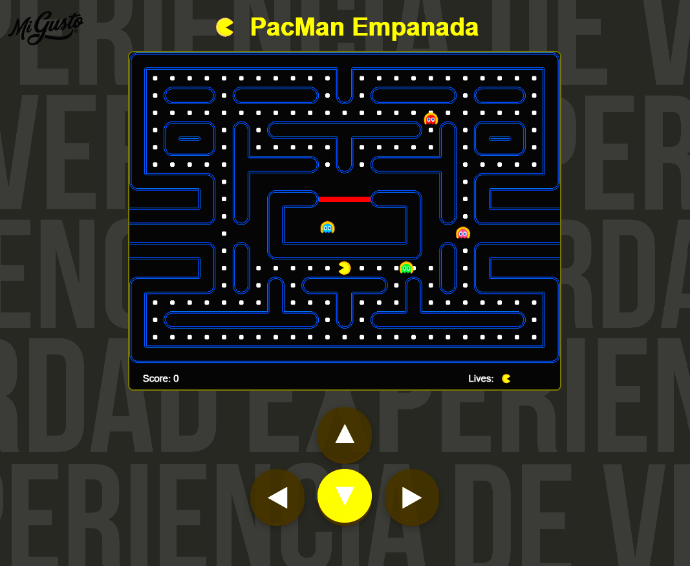

# Juegos para aperturas de nuevos locales 2026

Menú central de **juegos arcade temáticos sobre empanadas de Mi Gusto** utilizado en experiencias interactivas durante **aperturas de nuevos locales de Mi Gusto**.

Desde este menú se accede a distintos juegos web diseñados para funcionar en **múltiples plataformas y dispositivos**, generando una experiencia divertida e interactiva para los clientes.

Los juegos pueden ejecutarse en:

- celulares
- computadoras
- paneles táctiles
- tótems interactivos
- televisores
- pantallas de locales
- navegadores web en general

---

# Demo

## Menú principal

## Menú de selección de juego (Catch the Empanada)

## Juego Catch the Empanada

## Juego Empanada Crush

## Juego Empanada Puzzle

## Juego PacMan Empanada

---

# Juegos incluidos

Desde el menú principal `index.html` se puede acceder a los siguientes juegos:

- **Catch the Empanada**
- **Empanada Crush**
- **Empanada Puzzle**
- **PacMan Empanada**

Cada juego vive dentro de la carpeta `games/*/index.html` y se abre en el navegador como un **juego web independiente**.

---

# Características principales

- **Interfaz simple estilo kiosco interactivo**
- Menú central con grid de selección de juegos
- Iconos e ilustraciones claras para cada juego
- Diseñado para ejecutarse en **pantalla completa**
- Experiencia optimizada para **pantallas táctiles**
- **Multiplataforma**: funciona en celulares, computadoras, televisores, tótems y paneles interactivos
- **Responsive** y adaptable a distintos tamaños de pantalla
- Compatible con uso **online y offline**

---

# Tecnologías utilizadas

- HTML5  
- CSS3  
- JavaScript  
- React  

---

# Desarrolladores

- **Facundo Carrizo** — GitHub: [@facu14carrizo](https://github.com/facu14carrizo) · LinkedIn: [facu14carrizo](https://www.linkedin.com/in/facu14carrizo)
- **Ramiro Lacci** — GitHub: [@ramirolacci](https://github.com/ramirolacci) · LinkedIn: [ramiro-lacci](https://www.linkedin.com/in/ramiro-lacci)
